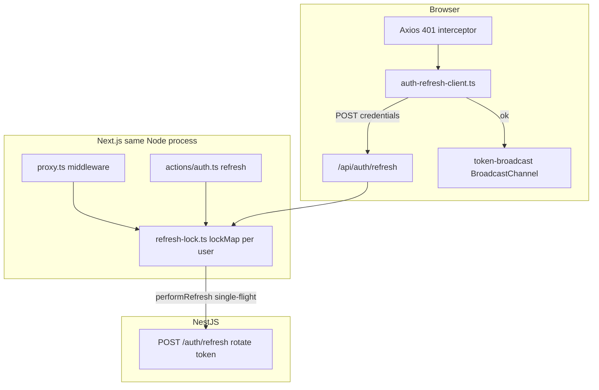
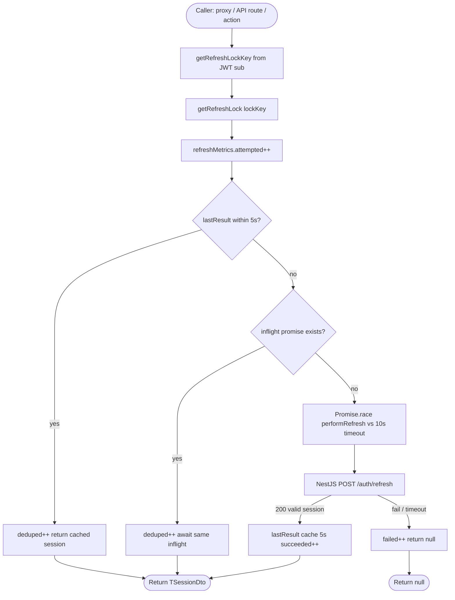
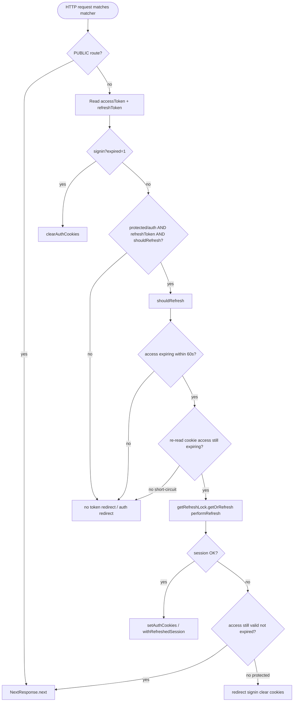
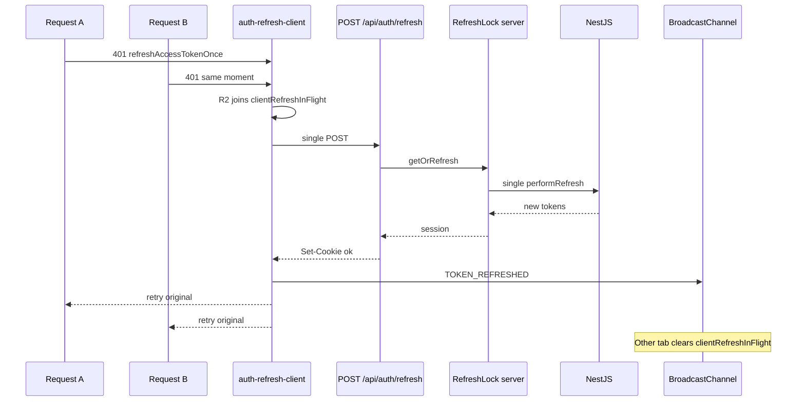
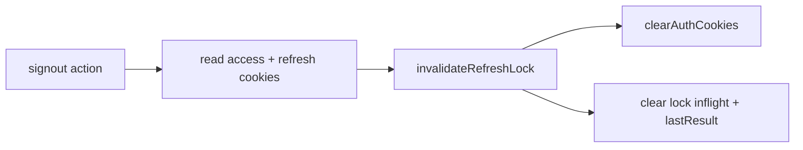

# Auth refresh token lock

How the frontend coordinates `POST /auth/refresh` when NestJS uses **rotating refresh tokens** (one-time use).

## Problem

Several independent code paths can refresh at the same time:

| Entry | File | Trigger |
|-------|------|---------|
| Middleware | `src/proxy.ts` | Each HTTP request when access token expires within **60s** |
| API route | `src/app/api/auth/refresh/route.ts` | Axios 401 → client refresh |
| Server action | `src/actions/auth.ts` `refresh()` | Explicit refresh |

Without coordination, the first call succeeds and invalidates the refresh token; parallel calls get `401 Already Used` or rate limits.

## Solution (hybrid A + C-lite)

- **A — In-memory lock** (`src/libs/refresh-lock.ts`): single-flight + **5s dedup cache** per user key, shared in the same Node.js process.
- **C-lite — Short-circuit** (`proxy.ts` `shouldRefresh`): re-read `accessToken` cookie; skip refresh if another request already refreshed.
- **Client** (`src/libs/auth-refresh-client.ts`): one in-flight `POST /api/auth/refresh` per tab for parallel 401s.
- **Multi-tab** (`src/libs/token-broadcast.ts`): `BroadcastChannel` notifies other tabs after refresh.

**Not covered (multiple pods):** lock is per-process. Cross-replica races need Redis or a backend reuse window (future).

## File map

```
src/libs/refresh-lock.ts          # RefreshLock, performRefresh, getRefreshLockKey
src/libs/auth-refresh-client.ts   # refreshAccessTokenOnce() for Axios
src/libs/token-broadcast.ts       # BroadcastChannel auth_tokens
src/proxy.ts                      # Proactive refresh + shouldRefresh
src/app/api/auth/refresh/route.ts # Client choke point (uses lock)
src/actions/auth.ts               # refresh() via lock; signout invalidates lock
src/libs/axios.ts                 # 401 → refreshAccessTokenOnce()
```

## Overview: three fronts, one server lock



## RefreshLock.getOrRefresh() (server)

Used by middleware, API route, and `refresh()` server action.



Constants:

| Constant | Value | Purpose |
|----------|-------|---------|
| `DEDUP_WINDOW_MS` | 5000 | Return cached session without calling backend |
| `PROMISE_TIMEOUT_MS` | 10000 | Avoid hung inflight promise |
| `LOCK_MAP_TTL_MS` | 3600000 | Remove idle lock entries from `lockMap` |

Lock key: JWT `sub` from access or refresh token; fallback `rt_{last12chars}`.

## Middleware proxy.ts (proactive refresh)



`REFRESH_THRESHOLD` in `proxy.ts` is **60** seconds before access JWT `exp`.

## Client: Axios 401 + multi-tab



## Signout



## Scope limits

| Scope | Behavior |
|-------|----------|
| Same pod / process | Middleware + API route + action share `lockMap` → one backend call per burst |
| Different K8s pods | May still race → Redis lock (future) |
| Different browser tabs | Separate client lock; `BroadcastChannel` reduces duplicate refresh |
| 5s after success | Callers hit dedup cache → no backend call |

## Pitfalls

1. **Edge vs Node** — If middleware runs on Edge, it may not share `lockMap` with API routes. Verify runtime on deploy.
2. **Timeout then retry** — After 10s timeout, a new caller might use a stale refresh token. Dedup window helps only if a prior call succeeded.
3. **Multi-tab** — Without BroadcastChannel, two tabs can each call refresh once.
4. **`router.refresh()`** — Extra middleware passes while access is still in the 60s window; lock + dedup limit backend spam.

## Verification (staging)

1. Access token within 60s of expiry → hard refresh a protected page → backend logs: **one** `201` refresh per burst.
2. DevTools: several parallel client 401s → **one** `POST /api/auth/refresh`.
3. Sign in, sign out, OAuth callback — no regression.
4. `pnpm check:types`

Optional: `refreshMetrics` in `refresh-lock.ts` — high `deduped / attempted` during a burst means the lock is working.

## Future work

- Redis distributed lock for multi-replica
- Backend refresh reuse window (5–10s)
- `ServerAPI` 401 auto-retry if needed after this fix
